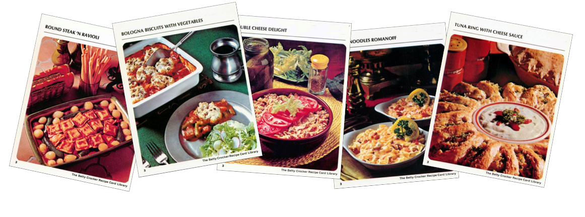
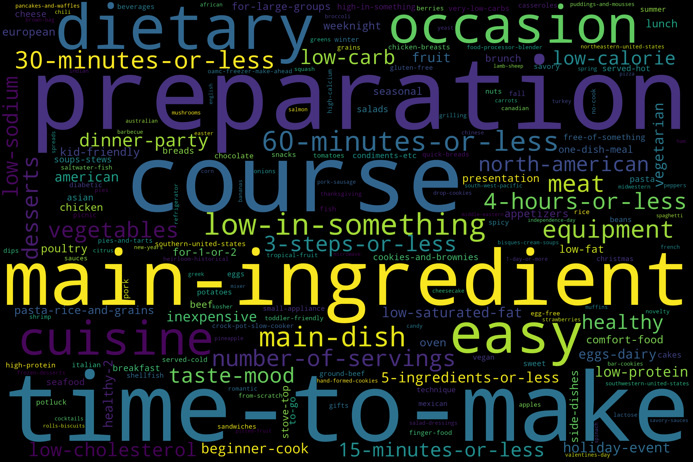

# What's for Dinner?
# Recipe Classification with NLP
 

Everyone needs to eat, and while ordering delivery or dining out each day sounds like an appealing solution to this condition very few people have the means to sustain such a lifestyle.  In a post-COVID world where [92% of households plan to cook at home more often](https://www.supermarketnews.com/consumer-trends/study-most-us-consumers-stick-eating-home-post-pandemic) the market for recipe websites and cookbooks is wide open. Equally in demand are "weeknight" meals - simple easy recipes that are quick to prepare after work.  Using data scraped from Food.com my logistic regression model has 71% accuracy in predicting if a recipe is easy or not

## Business Understanding

While initially seeming the perfect tool for home chefs the practical applications of this model apply to more then one target audience:

- home cooks could use this to check if a recipe fits their energy level and schedule, possibly by creating a web interface.
websites that host recipes, or companies with collections of recipes - for example a publisher - could use this to auto-classify their recipes, which in turn could be used for SEO, for general organizational purposes, or for automating their review process.

According to the Supermarket News article the number of people eating out at least once a week has dropped by 9% since COVID with more people planning to eat out less. This audience, many of whom did not cook much before the virus struck, are ripe for guidance towards simple, week-night, dinners be it via website or cookbook.

## Data Understanding

The data used to build my model comes from [Kaggle](https://www.kaggle.com/shuyangli94/foodcom-recipes-with-search-terms-and-tags) and consists of ~500,000 user-submitted recipes scraped from Food.com. In addition to the text of the recipes' description and instructions the dataset also contains columns breaking out the ingredients, search terms, tags, and individual steps for each recipe. The tag data comes from the recipe author from a list of options provided by Food.com whereas the search terms are, from all evidence, assigned by Food.com. There is also an "id" column that can be used to search for the recipe on Food.com.

This dataset does not have a target variable included so one needs to be constructed for it by leveraging the tag and search term data to find dinner recipes that can be called easy, be it because they're quick, simple to make, or have very few steps.

## Modeling and Evaluation

The baseline for this model was created by running numeric metadata about the recipes in my dataset, such as number of ingredients or number of characters in the recipe's description, through a LogisticRegression model to make sure that a model trained on these values would not outperform a model using NLP.  The baseline model had an accuracy of 55%, slightly better then simply guessing.

Initial testing on a wide array of types resulted in the best performances from MultinomialNB and LogisticRegression models using the TfidfVectorizer, with further hyperparameter tuning resulting in a model with 71% accuracy, 16% higher then the accuracy of the baseline model. This demonstrates that NLP is the better method for recipe difficulty classification. Running my final model on the holdout data resulted in 70% accuracy in overall predictions.  Accuracy was used as my primary evaluation metric because, as anyone who has used Yelp, small mistakes can easily inspire a heated response, and there are so many recipe websites out there that a user can simply walk away from one that has dissatisfied them. 

## Conclusion & Next Steps 

When evaluating the score results model accuracy was the top priority as the ramifications of someone using an incorrectly labeled recipe can be significant - errors misclassifying easy as not-easy or vice versa can lead to loss of time to the individual or loss of business on the side of the recipe provider  - look at Yelp to see how far one bad experience can enrage people - and reputation, while not easily quantified as other metrics, is crucial to maintain given how many recipe sites and cookbooks exist.  This makes it easier for someone, upon having a bad experience to simply find their recipes elsewhere and never look back. 

If given more time I would use it to improve my modle by:
- further testing of the DecisionTree model as I may have hobbled the basic version's performance to save processing time
- modeling with neural networks like MLPClassifier
- using scraping to collect popularity data on the recipes - how many ratings, the average rating

Once this model is sufficiently improved it will be a useful tool for websites and publishers of recipes, reducing the amount of effort, and inconsistency inherent in human evaluation, required to determine recipe difficulty. This model can also be expanded to include other recipe types - classifying if a recipe is an easy dinner, an easy lunch, or an easy breakfast. It also can stand as a jumping off point for developing models that predict if a recipe is healthy, or what kind of cuisine it describes.

## Repository Navigation
- Final notebook can be found [here](recipe-classification-with-nlp.ipynb)  
- Original data can be found [here](https://www.kaggle.com/shuyangli94/foodcom-recipes-with-search-terms-and-tags). Once downloaded and unzipped place 'foodcom_recipes_with_classification.csv' into a file called 'data'.
- Presentation pdf can be found [here](NLP_recipe_analysis_presentation.pdf)

